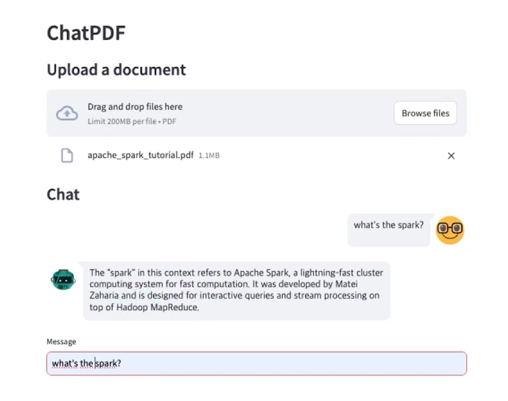

# ChatPDF

ChatPDF는 사용자가 PDF 문서와 질문-답변 인터페이스를 통해 상호작용할 수 있게 해주는 Streamlit 애플리케이션입니다. LangChain 프레임워크와 ChatOllama 모델의 기능을 활용하여, 이 애플리케이션은 사용자가 PDF 파일을 업로드하고, 그 내용을 기반으로 질문을 할 수 있도록 합니다. 사용자는 업로드된 문서의 내용을 바탕으로 질문을 하고, 애플리케이션은 간결한 답변을 제공합니다.

## 주요 기능

- **PDF 업로드**: 사용자는 여러 개의 PDF 문서를 업로드할 수 있습니다.
- **질문 답변**: 업로드된 PDF에 대해 질문할 수 있습니다.
- **실시간 응답**: 문서의 내용을 기반으로 즉시 답변을 받을 수 있습니다.
- **사용자 친화적인 인터페이스**: Streamlit을 사용하여 직관적인 사용자 경험을 제공합니다.

## 요구 사항

- Python 3.8 이상
- Streamlit
- LangChain
- PyPDF 또는 기타 PDF 처리 라이브러리

## 실행 방법

1. 리포지토리를 클론합니다:

   ```bash
   git clone https://github.com/hang-1n-there/Llama3_chat_pdf.git
   
2. 필요한 패키지를 설치합니다:

   ```bash
   pip install -r requirements.txt

3.  애플리케이션을 실행합니다:
   ```bash
    streamlit run /content/app.py &>/content/logs.txt &
    npx localtunnel --port 8501
   ```

## ChatPDF 미리보기
